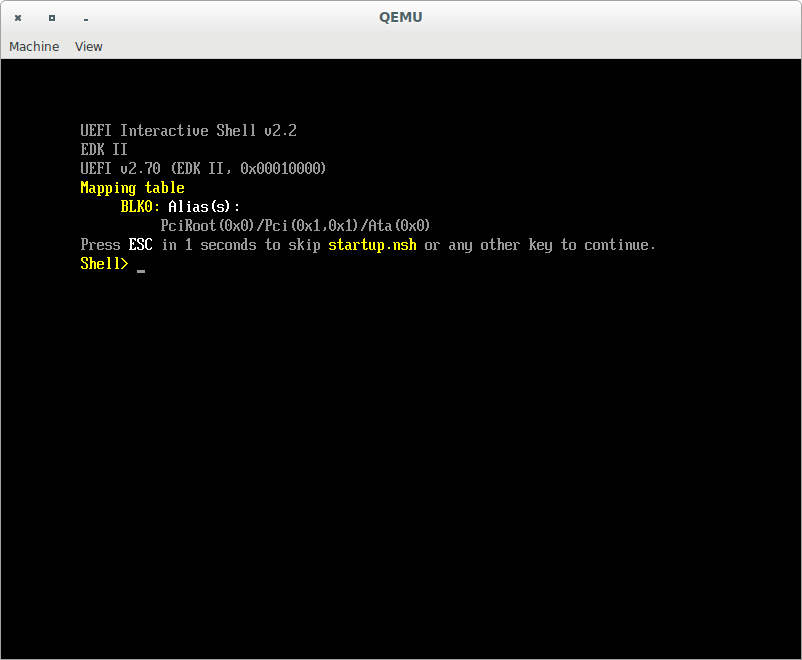

# hi-efi

* [tutorial from https://station.eciton.net/fun-and-games-with-gnu-efi.html](./station.eciton.net/)
* [tutorial from https://mjg59.dreamwidth.org/18773.html](./mjg59.dreamwidth.org/)
* [tutorial from http://www.rodsbooks.com/efi-programming/hello.html](./rodsbooks.com/)

## edk2

* https://github.com/tianocore/edk2/blob/master/Readme.md
* https://github.com/tianocore/tianocore.github.io/wiki/Using-EDK-II-with-Native-GCC
* https://github.com/tianocore/tianocore.github.io/wiki/Common-instructions
* https://github.com/tianocore/tianocore.github.io/wiki/How-to-build-OVMF

### build OVMF

    [21:47:54]~/___/github$ git clone https://github.com/tianocore/edk2.git
    Cloning into 'edk2'...
    remote: Enumerating objects: 149, done.
    remote: Counting objects: 100% (149/149), done.
    remote: Compressing objects: 100% (82/82), done.
    remote: Total 336217 (delta 78), reused 113 (delta 67), pack-reused 336068
    Receiving objects: 100% (336217/336217), 283.77 MiB | 31.42 MiB/s, done.
    Resolving deltas: 100% (242059/242059), done.
    Updating files: 100% (7201/7201), done.

    [21:48:36]~/___/github$ cd edk2/

    [21:48:47]~/___/github/edk2(master)$ git submodule update --init
    Submodule 'SoftFloat' (https://github.com/ucb-bar/berkeley-softfloat-3.git) registered for path 'ArmPkg/Library/ArmSoftFloatLib/berkeley-softfloat-3'
    Submodule 'CryptoPkg/Library/OpensslLib/openssl' (https://github.com/openssl/openssl) registered for path 'CryptoPkg/Library/OpensslLib/openssl'
    Cloning into '.../___/github/edk2/ArmPkg/Library/ArmSoftFloatLib/berkeley-softfloat-3'...
    Cloning into '.../___/github/edk2/CryptoPkg/Library/OpensslLib/openssl'...
    Submodule path 'ArmPkg/Library/ArmSoftFloatLib/berkeley-softfloat-3': checked out 'b64af41c3276f97f0e181920400ee056b9c88037'
    Submodule path 'CryptoPkg/Library/OpensslLib/openssl': checked out '50eaac9f3337667259de725451f201e784599687'

    [21:54:55]~/___/github/edk2(master)$ sudo apt-get install build-essential uuid-dev texinfo  bison flex libgmp3-dev libmpfr-dev subversion

    [22:03:50]~/___/github/edk2(master)$ make -C BaseTools
    make: Entering directory '.../___/github/edk2/BaseTools'
    make -C Source/C
    make[1]: Entering directory '.../___/github/edk2/BaseTools/Source/C'
    Attempting to detect HOST_ARCH from 'uname -m': x86_64
    Detected HOST_ARCH of X64 using uname.
    mkdir -p .
    mkdir ./libs
    make -C Common
    ...
    ----------------------------------------------------------------------
    Ran 280 tests in 1.162s

    OK
    make[1]: Leaving directory '.../___/github/edk2/BaseTools/Tests'
    make: Leaving directory '.../___/github/edk2/BaseTools'

    [23:58:06]C:~/___/github/edk2(master)$ . edksetup.sh 
    WORKSPACE: .../___/github/edk2
    EDK_TOOLS_PATH: .../___/github/edk2/BaseTools
    CONF_PATH: .../___/github/edk2/Conf
    Copying $EDK_TOOLS_PATH/Conf/build_rule.template
         to .../___/github/edk2/Conf/build_rule.txt
    Copying $EDK_TOOLS_PATH/Conf/tools_def.template
         to .../___/github/edk2/Conf/tools_def.txt
    Copying $EDK_TOOLS_PATH/Conf/target.template
         to .../___/github/edk2/Conf/target.txt

    [00:05:25]~/___/github/edk2(master)$ head -n 55 Conf/target.txt
    #
    #  Copyright (c) 2006 - 2019, Intel Corporation. All rights reserved. 
    #
    #  SPDX-License-Identifier: BSD-2-Clause-Patent
    #
    #
    #  ALL Paths are Relative to WORKSPACE

    #  Separate multiple LIST entries with a SINGLE SPACE character, do not use comma characters.
    #  Un-set an option by either commenting out the line, or not setting a value.

    #
    #  PROPERTY              Type       Use         Description
    #  ----------------      --------   --------    -----------------------------------------------------------
    #  ACTIVE_PLATFORM       Filename   Recommended Specify the WORKSPACE relative Path and Filename
    #                                               of the platform description file that will be used for the
    #                                               build. This line is required if and only if the current
    #                                               working directory does not contain one or more description
    #                                               files.
    ACTIVE_PLATFORM       = OvmfPkg/OvmfPkgX64.dsc

    #  TARGET                List       Optional    Zero or more of the following: DEBUG, RELEASE, NOOPT
    #                                               UserDefined; separated by a space character.
    #                                               If the line is missing or no value is specified, all
    #                                               valid targets specified in the platform description file 
    #                                               will attempt to be built. The following line will build 
    #                                               DEBUG platform target.
    TARGET                = DEBUG

    #  TARGET_ARCH           List       Optional    What kind of architecture is the binary being target for.
    #                                               One, or more, of the following, IA32, IPF, X64, EBC, ARM
    #                                               or AArch64.
    #                                               Multiple values can be specified on a single line, using
    #                                               space characters to separate the values.  These are used
    #                                               during the parsing of a platform description file, 
    #                                               restricting the build output target(s.)
    #                                               The Build Target ARCH is determined by (precedence high to low):
    #                                                 Command-line: -a ARCH option
    #                                                 target.txt: TARGET_ARCH values
    #                                                 DSC file: [Defines] SUPPORTED_ARCHITECTURES tag
    #                                               If not specified, then all valid architectures specified
    #                                               in the platform file, for which tools are available, will be
    #                                               built.
    TARGET_ARCH           = X64

    #  TOOL_DEFINITION_FILE  Filename  Optional   Specify the name of the filename to use for specifying
    #                                             the tools to use for the build.  If not specified,
    #                                             WORKSPACE/Conf/tools_def.txt will be used for the build.
    TOOL_CHAIN_CONF       = Conf/tools_def.txt

    #  TAGNAME               List      Optional   Specify the name(s) of the tools_def.txt TagName to use.
    #                                             If not specified, all applicable TagName tools will be
    #                                             used for the build.  The list uses space character separation.
    TOOL_CHAIN_TAG        = GCC5

    [00:05:30]C:~/___/github/edk2(master)$ build                                                                                                                                   
    Build environment: Linux-4.19.37-2rodete1-amd64-x86_64-with-Debian-rodete-rodete                                                                                               
    Build start time: 00:06:28, Aug.22 2019                                                                                                                                        
																						   
    WORKSPACE        = .../___/github/edk2                                                                                                               
    EDK_TOOLS_PATH   = .../___/github/edk2/BaseTools                                                                                                     
    CONF_PATH        = .../___/github/edk2/Conf                                                                                                          
    PYTHON_COMMAND   = /usr/bin/python3.6                                                                                                                                          
																						   
																						   
    Processing meta-data .                                                                                                                                                         
    Architecture(s)  = X64                                                                                                                                                         
    Build target     = DEBUG                                                                                                                                                       
    Toolchain        = GCC5                                                                                                                                                        
																						   
    Active Platform          = .../___/github/edk2/OvmfPkg/OvmfPkgX64.dsc                                                                                

    ...

    Fd File Name:OVMF (.../___/github/edk2/Build/OvmfX64/DEBUG_GCC5/FV/OVMF.fd)                                                                          
																						   
    Generate Region at Offset 0x0                                                                                                                                                  
       Region Size = 0x40000                                                                                                                                                       
       Region Name = DATA                                                                                                                                                          
	 
    Generate Region at Offset 0x40000                                                                                                                                              
       Region Size = 0x1000                                                                                                                                                        
       Region Name = None                                                                                                                                                          
																						   
    Generate Region at Offset 0x41000                                                                                                                                              
       Region Size = 0x1000                                                                                                                                                        
       Region Name = DATA                                                                                                                                                          
																						   
    Generate Region at Offset 0x42000
       Region Size = 0x42000                                                                                                         
       Region Name = None                                                                                                                                                          
											      
    Generate Region at Offset 0x84000                                                                                                                                              
       Region Size = 0x348000                                                                                                                                                      
       Region Name = FV                                                                                                                                                            
																						   
    Generating FVMAIN_COMPACT FV                                                                                                                                                   
																						   
    Generating PEIFV FV                                                                                                                            
    ####################################                                                                                                 
    Generating DXEFV FV                                                                                                                                                            
    #######################################                                       
    ########################################                                                                                                                        
    ########################################                                                                                                                                       
    ########################################                                                            
    ########################################                                                                                                                                       
    ########################################     
    ########################################                                                                                                                                       
    ########################################                                                         
    ########################################                                                                                                                                       
    Generate Region at Offset 0x3CC000                              
       Region Size = 0x34000                                                                                                                                                       
       Region Name = FV                       
																						   
    Generating SECFV FV                                      
    ######                                                                                                                                
    Fd File Name:OVMF_VARS (.../___/github/edk2/Build/OvmfX64/DEBUG_GCC5/FV/OVMF_VARS.fd)                                                                
																						  
    Generate Region at Offset 0x0                                                                                                                                    
       Region Size = 0x40000                                                                                                                                                       
       Region Name = DATA                                                                                 
																						   
    Generate Region at Offset 0x40000          
       Region Size = 0x1000                                                                                                                                                        
       Region Name = None                                                                                   
																						   
    Generate Region at Offset 0x41000                                    
       Region Size = 0x1000                                                                                                                                                        
       Region Name = DATA                   

    Generate Region at Offset 0x42000
       Region Size = 0x42000
       Region Name = None

    Fd File Name:OVMF_CODE (.../___/github/edk2/Build/OvmfX64/DEBUG_GCC5/FV/OVMF_CODE.fd)                                                               

    Generate Region at Offset 0x0
       Region Size = 0x348000
       Region Name = FV

    Generate Region at Offset 0x348000
       Region Size = 0x34000
       Region Name = FV

    Fd File Name:MEMFD (.../___/github/edk2/Build/OvmfX64/DEBUG_GCC5/FV/MEMFD.fd)                                                                       

    Generate Region at Offset 0x0
       Region Size = 0x6000
       Region Name = None

    Generate Region at Offset 0x6000
       Region Size = 0x1000
       Region Name = None

    Generate Region at Offset 0x7000
       Region Size = 0x1000
       Region Name = None
    Padding region starting from offset 0x8000, with size 0x8000

    Generate Region at Offset 0x8000
       Region Size = 0x8000
       Region Name = None

    Generate Region at Offset 0x10000
       Region Size = 0x10000
       Region Name = None

    Generate Region at Offset 0x20000
       Region Size = 0xE0000
       Region Name = FV

    Generate Region at Offset 0x100000
       Region Size = 0xB00000
       Region Name = FV

    GUID cross reference file can be found at .../___/github/edk2/Build/OvmfX64/DEBUG_GCC5/FV/Guid.xref                                                 

    FV Space Information
    SECFV [10%Full] 212992 total, 22384 used, 190608 free
    PEIFV [20%Full] 917504 total, 189992 used, 727512 free
    DXEFV [36%Full] 11534336 total, 4171456 used, 7362880 free
    FVMAIN_COMPACT [35%Full] 3440640 total, 1213664 used, 2226976 free

    - Done -
    Build end time: 00:07:55, Aug.22 2019
    Build total time: 00:01:27

see also:

* http://www.linux-kvm.org/page/OVMF
* http://www.linux-kvm.org/downloads/lersek/ovmf-whitepaper-c770f8c.txt

## boot OVMF

    [17:15:36]~/___/github/hi-efi(master)$ qemu-system-x86_64 -L . --bios ~/___/github/edk2/Build/OvmfX64/DEBUG_GCC5/FV/OVMF.fd -net none

